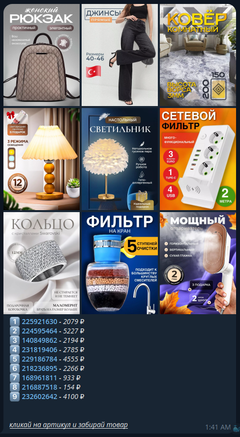

# createwbposts_bot

**createwbposts_bot** — это Telegram-бот, который принимает список артикулов товаров с Wildberries, парсит данные этих товаров и автоматически генерирует посты с информацией о товаре.

## Возможности

- **Парсинг данных** с Wildberries:
  - Сбор информации по артикулу, включая название, цену, изображения и ссылки на товары.
- **Генерация групповых Telegram-постов**:
  - Включает ссылки на товары, актуальные цены и изображения.
- Простота использования:
  - Просто отправьте список артикулов через сообщение.
  - Поддержка любого количества артикулов в одном запросе (от 9).

- пример ввода: 225921630 224595464 140849862 231819406 229186784 218236895 168961811 216887518 232602642

---

## Установка и настройка

* `git clone 'https://github.com/kirill43qw/createwbposts_bot' && cd createwbposts_bot`  
* `python3 -m venv .venv && source .venv/bin/activate` - создаём и активируем виртуальную среду
* `pip install -r requirements.txt` - устанавливаем зависимости
*  `touch .env` - создаём файл переменных окружения и нужно добавить туда ваш token бота и указать id пользователей, которые могут пользоваться этим ботом. .env_example пример
*  python3 main.py - запускаем бота

 ---
